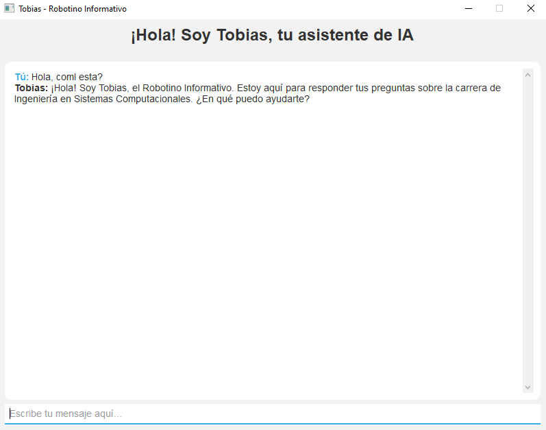
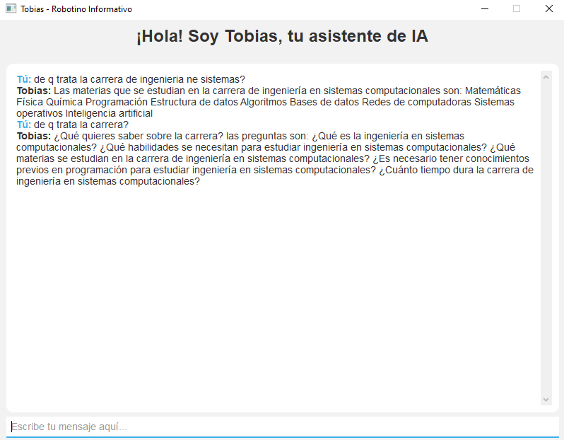
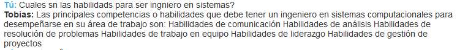
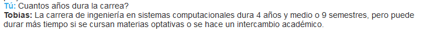
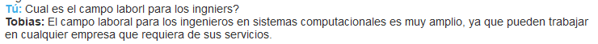

# Tobias - Robotino Informativo

¡Bienvenido a Tobias - Robotino Informativo! Este es un asistente de IA desarrollado por Luis F. Chávez para la materia de Inteligencia Artificial. Proporciona información sobre ingeniería en sistemas computacionales y responde preguntas frecuentes.

## Estructura del repositorio

- `models`: Directorio que contiene los modelos entrenados del asistente.
- `bot_tobias.py`: Archivo principal que ejecuta la interfaz gráfica de Tobias.
- `config.yml`: Archivo de configuración de Rasa para el entrenamiento del modelo.
- `domain.yml`: Archivo que define los dominios, intenciones y respuestas del asistente.
- `nlu.yml`: Archivo que contiene los ejemplos de entrenamiento para el procesamiento del lenguaje natural.
- `stories.yml`: Archivo que define los escenarios de conversación para el entrenamiento del modelo.
- `train.py`: Archivo para entrenar el modelo del asistente.
- `requirements.txt`: Archivo que contiene las dependencias del proyecto.

## Configuración del entorno virtual

1. Crea un nuevo entorno virtual con `python -m venv myenv`.
2. Activa el entorno virtual con `source myenv/bin/activate` (Linux/macOS) o `myenv\Scripts\activate` (Windows).
3. Instala las dependencias con `pip install -r requirements.txt`.

## Cómo ejecutar Tobias

1. Asegúrate de tener el entorno virtual activado.
2. Ejecuta el comando `python train.py` para entrenar el modelo del asistente.
3. Una vez entrenado el modelo, ejecuta `python bot_tobias.py` para iniciar la interfaz gráfica de Tobias.
4. Interactúa con el asistente, realiza preguntas y explora la información sobre ingeniería en sistemas computacionales.

## Capturas de pantalla

A continuación se muestran algunas capturas de pantalla de la interfaz de Tobias:

¡Disfruta de la experiencia interactiva con Tobias!

