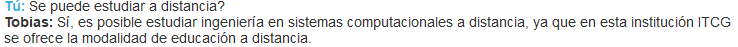
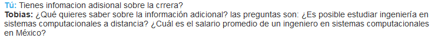

# Tobias - Robotino Informativo

¡Bienvenido a Tobias - Robotino Informativo! Este es un asistente de IA desarrollado por Luis F. Chávez para la materia de Inteligencia Artificial. Proporciona información sobre ingeniería en sistemas computacionales y responde preguntas frecuentes.

## Estructura del repositorio

- `models`: Directorio que contiene los modelos entrenados del asistente.
- `bot_tobias.py`: Archivo principal que ejecuta la interfaz gráfica de Tobias.
- `config.yml`: Archivo de configuración de Rasa para el entrenamiento del modelo.
- `domain.yml`: Archivo que define los dominios, intenciones y respuestas del asistente.
- `nlu.yml`: Archivo que contiene los ejemplos de entrenamiento para el procesamiento del lenguaje natural.
- `stories.yml`: Archivo que define los escenarios de conversación para el entrenamiento del modelo.
- `train.py`: Archivo para entrenar el modelo del asistente.
- `requirements.txt`: Archivo que contiene las dependencias del proyecto.

## Configuración del entorno virtual

1. Crea un nuevo entorno virtual con `python -m venv myenv`.
2. Activa el entorno virtual con `source myenv/bin/activate` (Linux/macOS) o `myenv\Scripts\activate` (Windows).
3. Instala las dependencias con `pip install -r requirements.txt`.

## Cómo ejecutar Tobias

1. Asegúrate de tener el entorno virtual activado.
2. Ejecuta el comando `python train.py` para entrenar el modelo del asistente.
3. Una vez entrenado el modelo, ejecuta `python bot_tobias.py` para iniciar la interfaz gráfica de Tobias.
4. Interactúa con el asistente, realiza preguntas y explora la información sobre ingeniería en sistemas computacionales.

## Capturas de pantalla

A continuación se muestran algunas capturas de pantalla de la interfaz de Tobias, en las pruebas, intenté equivocarme en la manera que escribía, para que de esa forma se demuestre el funcionamiento del NLP:

Estas son solo algunas de las preguntas y respuestas que pueden hacerle, pero puedes probarlo con:

1. ¿Cuál es el plan de estudios de la carrera?
2. ¿Cuáles son los requisitos de ingreso para la carrera?
3. ¿Qué oportunidades de prácticas profesionales hay disponibles para los estudiantes?
4. ¿La carrera ofrece programas de intercambio estudiantil?
5. ¿Qué habilidades se desarrollan durante la carrera?
6. ¿Cuáles son las áreas de especialización disponibles?
7. ¿Qué tipo de proyectos se realizan durante la carrera?
8. ¿Existen programas de tutorías o apoyo académico para los estudiantes?
9. ¿Cuál es la carga académica promedio por semestre?
10. ¿La carrera tiene convenios con empresas o instituciones externas?
11. ¿Qué oportunidades de empleo existen para los graduados?
12. ¿La carrera ofrece posibilidades de continuidad académica, como maestrías o doctorados?
13. ¿Qué recursos tecnológicos están disponibles para los estudiantes?
14. ¿Cuáles son los requisitos de titulación para los estudiantes?
15. ¿La carrera cuenta con laboratorios especializados?
16. ¿Qué tipo de proyectos o investigaciones se realizan en el departamento o facultad?
17. ¿Cuál es el perfil del profesorado de la carrera?
18. ¿Cuál es el promedio de egresados que encuentran empleo después de graduarse?
19. ¿La carrera organiza eventos o conferencias relacionadas con el campo de la ingeniería en sistemas?
20. ¿Cuál es la reputación de la carrera en el ámbito profesional y académico?

¡Disfruta de la experiencia interactiva con Tobias!

